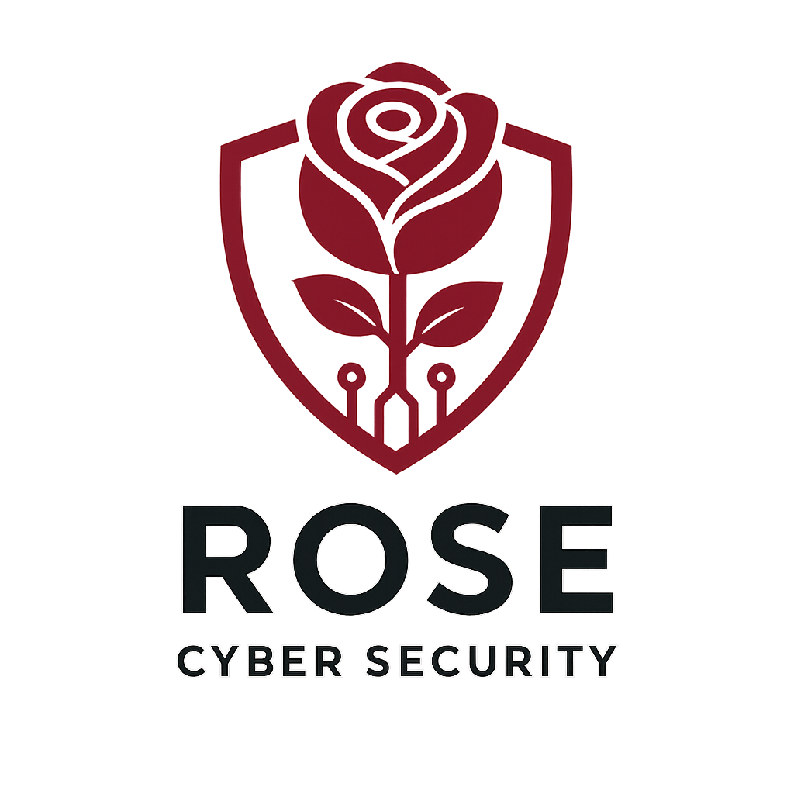

# 🌹 RoseLimiter - Network Traffic Monitor & Firewall



A powerful Windows application for real-time network traffic monitoring and control, similar to NetLimiter. Built with C# and WPF.

## ✨ Features

- 📊 **Real-time Traffic Monitoring** - Monitor download/upload speeds per application and process
- 🌐 **Live Traffic Graph** - Beautiful real-time visualization with color-coded upload/download
- 🚫 **Network Blocking** - Block incoming/outgoing traffic per application using Windows Firewall
- 🔍 **Process Hierarchy** - View network usage grouped by application with expandable process IDs
- 🎨 **Modern UI** - Dark theme with intuitive design inspired by NetLimiter
- 📦 **Deep Packet Inspection** - Uses SharpPcap for packet capture and analysis

## 🛠️ Technical Stack

- **Framework**: .NET 9.0, WPF
- **Packet Capture**: SharpPcap 6.3.1
- **Firewall Control**: Windows Firewall (netsh)
- **Process Mapping**: Windows IPHLPAPI (GetExtendedTcpTable)

## 📋 Requirements

- Windows 10/11
- Administrator privileges (required for packet capture and firewall rules)
- .NET 9.0 Runtime
- WinPcap or Npcap installed

## 🚀 Installation & Running

1. Clone the repository:
```bash
git clone https://github.com/YOUR_USERNAME/RoseLimiter.git
cd RoseLimiter
```

2. Build and run (as Administrator):
```bash
dotnet run
```

Or open with Visual Studio and run as Administrator.

## 🎯 Usage

1. **Monitor Traffic**: Launch the app to see all network-active applications
2. **View Details**: Click the arrow to expand and see individual process IDs
3. **Block Traffic**: 
   - Click ⬇️ button to block incoming packets
   - Click ⬆️ button to block outgoing packets
   - Click again to remove the block
4. **Traffic Graph**: Watch real-time traffic visualization in the bottom-right panel

## 📸 Screenshots


*Coming soon*

## ⚠️ Disclaimer

This tool is for educational and network management purposes only. Use responsibly and in compliance with local laws.

## 🤝 Contributing

Contributions are welcome! Please feel free to submit a Pull Request.

## 📄 License

MIT License - feel free to use for personal or commercial projects.

## 👨‍💻 Author

**Rose Cyber Security**

---

⭐ Star this repo if you find it useful!
